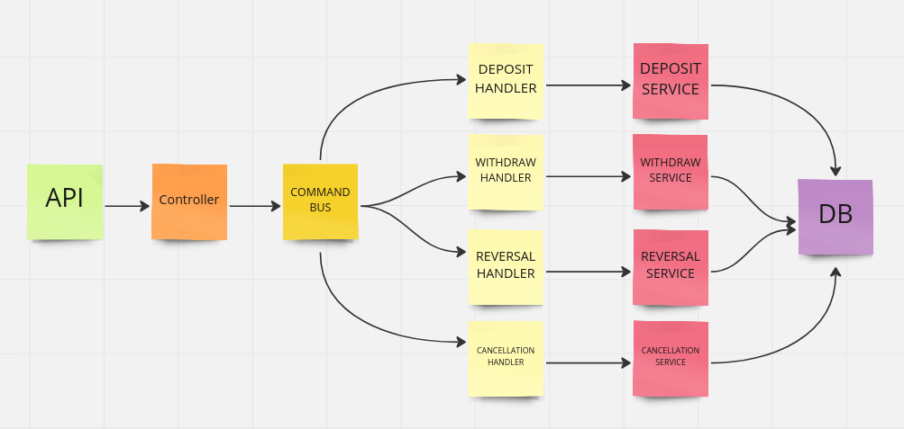

# Descrição do projeto

Projeto de carteira digital feito em NestJS. O projeto oferece os seguintes recursos:
- Crição de conta;
- Acesso ao saldo da conta;
- Acesso ao extrato da conta;
- Deposito de valor;
- Retirada de valor;
- Realizar compra;
- Cancelar compra;
- Extorna valor de uma compra.

O sistema foi contruído e testado utilizando docker.
Algumas bibliotecas muito conhecidas e utilizadas no projeto são:
- TypeORM
- Swagger

Para conhecer todas as bibliotecas utilizadas, acesse o arquivo package.json.


Arquitetura do projeto:

De forma não muito complexa o projeto foi realizado da seguinte forma: as requisições de manipulação da conta chegam no controller,
que dispara um comando especifíco para cada ação solicitada. Para cada comando, existe um manipulador observando, assim, quando um comando
é disparado, o manipulador responsável por aquele comando é executado, chamando um serviço específico que executará toda a lógica do sistema.
A execução é realizada de forma assíncrona. 

## Para executar a aplicação, siga todos os passos descritos abaixo:

### Clone este projeto na sua máquina.

### Suba o projeto via docker compose
```bash
docker compose up --build
```

### Instale as dependências do projeto
```bash
docker exec -it digital_wallet npm i
```

### Rode as migrations para gerar as tabelas do banco
```bash
docker exec -it digital_wallet npm run migration
```

### Execute o teste e obtenha o relatório de cobertura
```bash
docker exec -it digital_wallet npm run test:cov
```
**Após isso, abra o arquivo coverage/lcov-report/index.html no seu navegador preferido.**

### Para iniciar a apllicação
```bash
docker exec -it digital_wallet npm run start
```
**No navegador, acesse localhost:3000/api para acessar a documentação da api.**

## Executando ações

Por meio da documentação encontrada no endereço **localhost:3000/api**, é possível fazer todas
as requisições possíveis. É importante saber que a primeira coisa a ser feita é criar um usuário,
e então fazer o restante das requisições enviando os dados necessários.